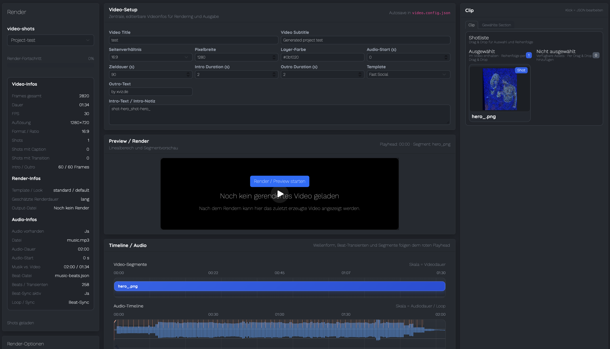

# ShotFlow

Awesome video Renderer. ☺️ 

Findet auch die Beats. 

Produktvideo, Bewerbung, Präsentation. Stay tuned …

---
⚠️ *This project has moved to a commercial model. The version on GitHub is a limited / legacy version.*




## Overview

**ShotFlow** is a video rendering and recording workflow designed to automatically generate clean, structured videos.

It combines rendering, timing and beat detection to help create polished videos for different use cases — from product demos to presentations.

The goal:  
Turn ideas into finished videos **fast and automatically**.

### Video creation like coding a presentation

- reproducible
- automated
- structured
- fast

ShotFlow also aims to make product presentation video production part of the **developer workflow**. 


## Features

- 🎬 Video rendering workflow
- 🥁 Beat detection for timing visuals
- ⚡ Automated video generation
- 🧠 Simple workflow for repeatable videos
- 🧩 Built for modular video pipelines
- 🎤 Works great for narrated content
- 🎬 Drag & drop shot management (select, reorder, assign)
- 🧩 JSON-based clip editing (title, duration, transitions, captions)
- 🎵 Audio timeline with waveform & beats
- 📊 Live video metadata and render insights
- ⚡ Fast preview & rendering workflow


## Use Cases

ShotFlow can be used for:

- Product videos
- Developer demos
- Presentations
- Bewerbungen (video resumes)
- Social media clips
- Documentation videos


## Example Workflow and usage

```
content → beat detection → scene timing → render → final video
```

1. Load a project (video-shots)
2. Drag shots from right → left to select
3. Reorder selected shots
4. Click a shot to edit metadata
5. Render preview or final video


1. Prepare your content (text, assets, or scenes)
2. Detect beats in the audio track
3. Automatically align scenes and visuals
4. Render the final video


## Tech Stack

- Remotion
- Vanilla JS (modular)
- Bootstrap 5
- SortableJS
- D3 (audio timeline)

## Notes

- Video settings are autosaved
- Drag & drop is fully handled by SortableJS (no native DnD)
- UI is optimized for fast iteration, not final UX polish

---

Minimal, fast, and focused on getting video ideas rendered quickly.


## Status

⚠️ This repository is no longer actively maintained.
Nehm es als Seed für Codex oder Claude und mach was draus. Die Welt hat sich geändert.
